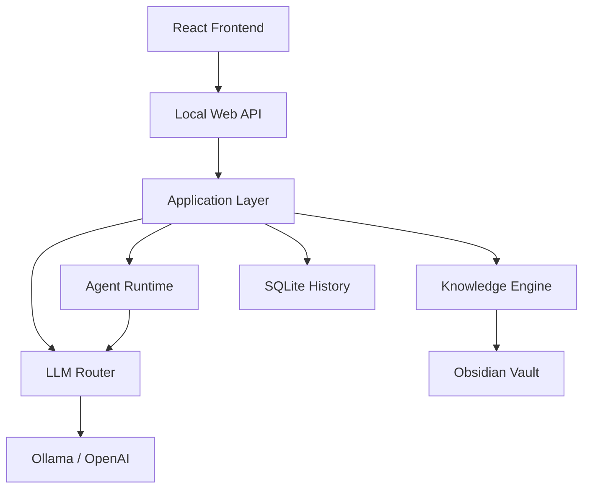

# PersonalAI

PersonalAI is a local-first AI engineering assistant designed to help software engineers work with their own knowledge base, code repositories, and local language models.

It combines knowledge retrieval, AI-assisted development workflows, benchmarking, and safe knowledge management into a single engineering-focused platform.

## Project Status

- `MVP`
- `Stable core workflows`
- `Under active development`

## Core Capabilities

- Grounded technical answers from an Obsidian knowledge base
- Multi-turn coding chat with task continuity and follow-up recovery
- Repo-aware planning and agent-style execution workflows
- Safe draft/write note pipeline with approval gates
- Benchmark-driven model evaluation and regression testing
- Optional web grounding for freshness-sensitive questions

## Design Goals

- Local-first operation
- Reproducible behavior
- Grounded responses
- Observable workflows
- Safe knowledge mutation
- Modular architecture

## Technology Stack

| Area | Technology |
| --- | --- |
| Backend | Python 3.10+, custom local JSON API (`http.server`) |
| Frontend | React, Vite |
| LLM Runtime | Ollama, OpenAI Responses API |
| Knowledge Base | Obsidian Markdown vault |
| Local Storage | SQLite |
| Runtime / Ops | PowerShell, `.env` configuration |

## Architecture



High-level responsibilities:

- `application/` orchestrates product workflows
- `domain/` contains core models
- `infrastructure/` handles config, vault IO, LLM clients, history, and web search
- `cli_app/` and `web_app/` expose local product entrypoints

See [docs/architecture.md](docs/architecture.md) for the fuller breakdown.

## Current Components

- `Knowledge Engine`: vault ingestion, indexing, scoped retrieval, and grounded answer preparation
- `LLM Router`: local/hosted model routing, reasoning-mode control, and web-grounding injection
- `Agent Runtime`: repo-aware planning, execution-stage artifacts, and follow-up continuity
- `Benchmark Engine`: benchmark packs, compare runs, persistence, and regression tracking
- `Runtime Manager`: frontend/backend/Ollama process control and health visibility
- `Web API + React UI`: local product surface for coding chat and operational workflows

## Example Workflow

1. A developer asks a technical question or requests a coding task.
2. PersonalAI retrieves scoped notes from the local knowledge base.
3. The routing layer selects the appropriate workflow and model path.
4. The assistant generates a grounded answer with citations or follow-up context.
5. If the task becomes knowledge work, PersonalAI can draft a note update.
6. The draft passes through approval-aware mutation rules before touching the vault.
7. The result and artifacts are stored in local history for review and benchmarking.

## Implemented

- Recursive vault scanning, note parsing, and graph-aware retrieval
- Grounded ask flow and implementation-scoping flow
- Multi-turn coding chat continuity
- Repo-aware agent runtime with planning/execution artifacts
- Safe note draft, write, refactor, and maintenance workflows
- Benchmark packs, benchmark history, and model comparison flows
- Web grounding with provider abstraction, health checks, and degradation handling
- Local runtime manager for frontend, backend, and Ollama

## Planned

- Further frontend simplification toward a production chat UX
- Stronger runtime self-healing and recovery behavior
- Deeper agent execution reliability for multi-step coding work
- Broader benchmark packs and evaluation coverage
- Continued documentation and product hardening

## Quick Start

### 1. Configure the environment

```powershell
Copy-Item .env.example .env
```

Important settings include:

- `PERSONAL_AI_HOME`
- `PERSONAL_AI_ENV_FILE`
- `OLLAMA_BASE_URL`
- `OLLAMA_HOST`
- `OLLAMA_MODELS`
- `OLLAMA_TIMEOUT_SECONDS`
- `PERSONAL_AI_DEFAULT_MODEL`
- `OPENAI_API_KEY`
- `OPENAI_BASE_URL`

### 2. Start the local stack

```powershell
npm run runtime:start
```

Useful runtime commands:

```powershell
npm run runtime:status
npm run runtime:restart
npm run runtime:stop
npm run runtime:start:ollama
npm run runtime:start:backend
npm run runtime:start:frontend
```

### 3. Run tests

```powershell
cmd /c "set PYTHONPATH=src&& python -m unittest discover -s tests"
```

Focused benchmark regression suite:

```powershell
cmd /c "set PYTHONPATH=src&& python -m unittest tests.test_cli_benchmark"
```

## Repository Structure

```text
personal_ai_mvp/
  frontend/
  src/
    application/
    cli_app/
    domain/
    infrastructure/
    web_app/
  tests/
  training_examples/
  manage_runtime.ps1
  pyproject.toml
  package.json
```

## Documentation

- [Architecture](docs/architecture.md)
- [API](docs/api.md)
- [Benchmarks](docs/benchmarks.md)
- [Development](docs/development.md)
- [Roadmap](docs/roadmap.md)

## Demo

A short UI GIF or screenshot walkthrough is planned next so the repository shows the full ask → answer → draft-note loop visually, not only through documentation.

## Why This Repository Exists

PersonalAI is an ongoing engineering project focused on building a reliable local AI assistant for software development.

This repository explores practical problems around retrieval, model routing, evaluation, agent workflows, and safe knowledge management while keeping the system modular, measurable, and suitable for everyday engineering use.
