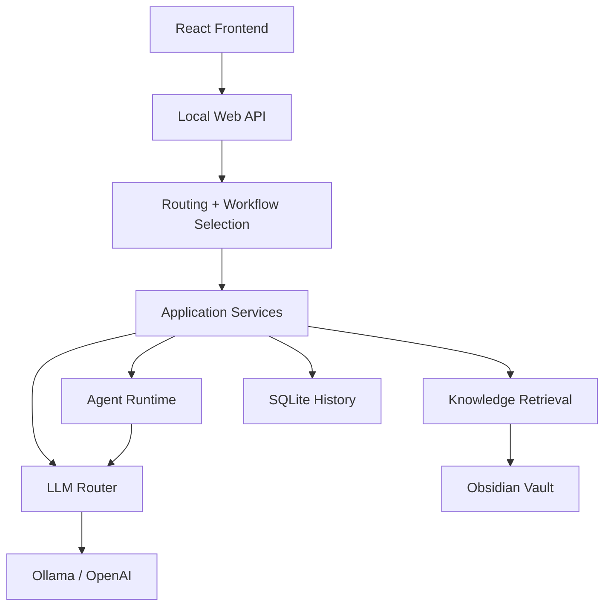

# Architecture

## Overview

PersonalAI is a local-first AI engineering assistant built around a few clear layers:

- `application/` for workflows and orchestration
- `domain/` for core models
- `infrastructure/` for IO, config, providers, and persistence
- `cli_app/` and `web_app/` for entry surfaces

## Primary Runtime Flow

## Layer Responsibilities

### `application/`

Owns product behavior:

- chat workflows
- benchmark execution
- note drafting and mutation policies
- agent runtime orchestration
- retrieval and answer preparation
- web-grounding integration

### `domain/`

Defines stable data structures such as:

- prompt messages
- generated answers
- agent runtime artifacts
- retrieval bundles
- benchmark result objects

### `infrastructure/`

Provides integrations and concrete services:

- vault readers
- frontmatter parsing
- SQLite history repository
- Ollama and OpenAI model clients
- custom local JSON API handler built on `http.server`
- settings and `.env` loading
- web search providers

### `cli_app/`

Provides:

- argument parsing
- dispatch
- renderer output for local CLI flows

### `web_app/`

Provides:

- local HTTP API
- frontend wiring
- runtime health/status exposure

## Architectural Themes

- local-first by default
- feature-oriented packaging
- standard-library-first where practical
- explicit runtime boundaries
- benchmark-driven product iteration

## Related Files

- `src/application/`
- `src/domain/`
- `src/infrastructure/`
- `src/cli_app/`
- `src/web_app/`
